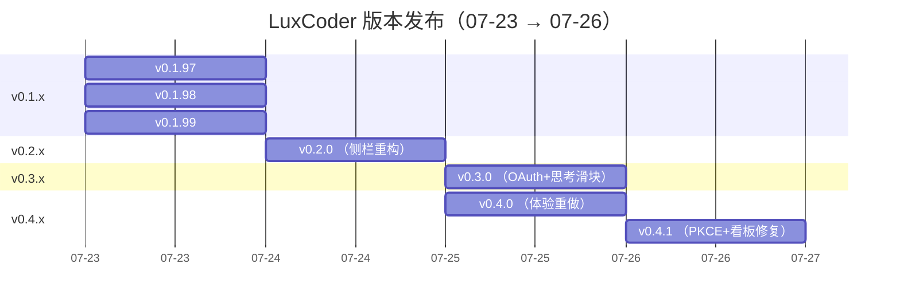
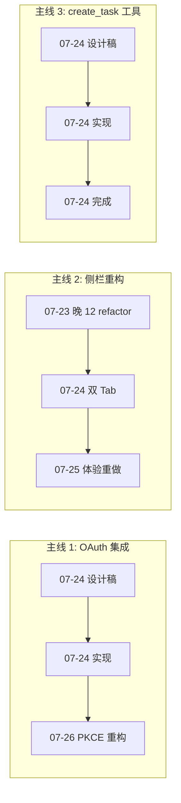

# LuxCoder 开发活动调研报告：2026-07-23 ~ 07-26

> 报告生成：2026-07-26 · 覆盖 4 天 88 个非合并 commits，约 38,250 行新增 / 3,350 行删除

---

## 1. 概览

| 维度 | 数值 |
|------|------|
| 时间跨度 | 2026-07-23 00:57 ~ 07-26 01:41（北京时间） |
| 总 commits（非合并） | **88** |
| 总新增行 | ~38,250 |
| 总删除行 | ~3,350 |
| 版本发布 | **7 个**（v0.1.97 → v0.4.1），日均 1.75 个 release |

### 分类统计

| 类别 | 提交数 | 新增/删除 | 核心主题 |
|------|--------|-----------|----------|
| ✨ Feature | **22** | ~+5,500 / -600 | OAuth 集成、create_task 工具链、UI 体验重构 |
| 🐛 Fix | **22** | ~+2,100 / -1,600 | 诊断脱敏、OAuth 守卫、UI 状态修复、PKCE 重构 |
| 🔧 Refactor | **18** | ~+650 / -1,100 | Ink 设计系统、侧栏组件清理、Main 层提取 |
| 📝 Chore | **26** | ~+30,000 / -50 | 6 份 Design Spec + 6 份 Plan、7 个版本发布 |
| **合计** | **88** | **~+38,250 / -3,350** | — |

### 版本节奏

---

## 2. 新增功能（22 commits）

### 2.1 OAuth 集成（8 commits，主线 1）

OAuth 是本周最大功能投入，从设计稿到实现到测试形成完整闭环：

| # | 日期 | 描述 | 关键文件 | 行数 |
|---|------|------|----------|------|
| 1 | 07-24 | 注册 `anthropic-oauth` provider 类型 | `types/channel.ts` | +7 |
| 2 | 07-24 | ClaudeOAuthCredentials 序列化/解析/过期助手 | `types/channel.ts` | +56 |
| 3 | 07-24 | **claude-oauth-service 启动捆版 claude 二进制** | `claude-oauth-service.ts` + test | **+217** |
| 4 | 07-24 | 接入 CLAUDE_OAUTH_LOGIN/CANCEL IPC 通道 | `ipc.ts`, `preload/index.ts` | 3 文件 |
| 5 | 07-24 | 路由 anthropic-oauth 通道到 CLAUDE_CODE_OAUTH_TOKEN | `agent-sdk-auth-env.ts` | +25 |
| 6 | 07-24 | 解析 anthropic-oauth 通道运行时 token | `channel-manager.ts` | +28 |
| 7 | 07-24 | **Claude Pro/Max OAuth 登录 UI** | `ChannelForm.tsx` | **+120** |
| 8 | 07-26 | **PKCE 原生方案重写**（回滚 spawn 方案） | `claude-oauth-service.ts` 重构 284 行 | **+874/-635** |

> **OAuth 链路：** Provider 类型声明 → 凭据序列化 → 服务模块（捆版二进制） → IPC 通道桥接 → 环境变量注入 → 运行时解析 → UI 登录表单

### 2.2 create_task 工具链（4 commits）

| # | 日期 | 描述 | 关键文件 | 行数 |
|---|------|------|----------|------|
| 1 | 07-24 | buildMinimalTaskSpec 单节点任务创建 | `tasks/build-minimal-spec.ts` | — |
| 2 | 07-24 | 添加 `task` builtin MCP 分类 | `BuiltinMcpDetailSheet.tsx` | — |
| 3 | 07-24 | **create_task Agent 工具** | `create-task-agent-tool.ts` | **+132** |
| 4 | 07-24 | 注册到 builtin MCP registry | `builtin-mcp/registry.ts` | — |

> 半天内完成完整 builtin MCP 工具链路：声明 manifest → 实现 Agent tool → 注册 registry → SDK 侧接入

### 2.3 UI 体验重构（10 commits）

| # | 日期 | 描述 | 关键文件 |
|---|------|------|----------|
| 1 | 07-23 | 共享 SessionHeader 组件 | `components/tabs/SessionHeader.tsx` |
| 2 | 07-23 | 代码主视图切换移入侧栏 | `LeftSidebar.tsx`, `MainArea.tsx` |
| 3 | 07-23 | 折叠 rail 图标排序 | `LeftSidebar.tsx` |
| 4 | 07-24 | 折叠会话列表头切换 | `LeftSidebar.tsx` |
| 5 | 07-24 | ProjectSwitcher 组件入口 | `ProjectSwitcher.tsx` |
| 6 | 07-25 | **思考深度连续滑动滑块** | `thinking-level-slider.tsx`（**+160**） |
| 7 | 07-25 | 侧栏折叠 → TabBar + Agent Experts 入口 | `LeftSidebar.tsx`, `TabBar.tsx` |
| 8 | 07-25 | **项目/会话侧栏体验重做（最大 Feature）** | `LeftSidebar.tsx`（**+512**） 等 43 文件 |
| 9 | 07-25 | 会话列表紧凑筛选 + 自定义分组 | `agent-session-group-service.ts` |

---

## 3. 修复问题（22 commits）

### 3.1 核心 Bug 修复

| 严重度 | 问题 | 修复 SHA | 涉及文件 |
|--------|------|----------|----------|
| 🔴 | **执行过程吞正文、短消息乱换行、会话列表卡死** | `10c4842e` | `orchestrator.ts`, `chat-service.ts`, `ProcessBlockGroup.tsx` 等 15 文件 |
| 🔴 | **OAuth 卡死 + 看板对齐** | `a63dbf60` | `claude-oauth-service.ts` 重构 284 行，共 25 文件 |
| 🟡 | OAuth 诊断日志 token 未完全脱敏 | `3832eec2` → `fd32147c` | `claude-oauth-service.ts` |
| 🟡 | 清理过期 Anthropic env 时未清除 token | `4e1a97d1` | `agent-orchestrator.ts` |
| 🟡 | Chat 模式未守卫 anthropic-oauth | `75624015` | `chat-service.ts` |
| 🟡 | K3 模型 ID 错误（k3 → kimi-k3） | `1d65a330` | `channel-manager.ts` |
| 🟡 | create_task 缺 workspace 时报错不清晰 | `0f9061b7` | `create-task-agent-tool.ts` |
| 🟡 | 共享 slug 冲突保护缺失 | `afcb12c6` | `task-handlers.ts`, `tasks/storage.ts` |

### 3.2 UI/UX 修复

| 问题 | SHA | 修复内容 |
|------|-----|----------|
| 未签名 macOS 重启报错 | `47a7a634` | 跳过检查失败 |
| 新会话强制展开项目面板 | `ae96198c` | 改为按需展开 |
| 重命名失败不退出编辑态 | `a77324e9` | 退出态 |
| 置顶按钮错误处理 | `68a26578` | 加错误处理 + 重置编辑态 |
| 切代码视图不重置 | `c2cd74bc` | 重置 active view |
| 侧栏折叠后 TabBar 避让红绿灯 | `d09f13ca` | macOS 全屏自适应 |
| 空态 Chat\|Code 顺序颠倒 | `7d490b6b` | 修正 + OpenMoji 吉祥物 |
| 会话列表折叠态优化 | `a6da0afd` | 初始量 + 一键展开 |
| 会话列表状态点 + 折叠交互 | `0c7e18ec` | +418 行完整重写 |
| 误移植任务编排横幅 | `a758d8a1` | 删 314 行 + 单行胶囊 |
| 持久化 draftSession + 启动迁移 | `383a35de` | 避免空会话丢失 |
| 4 个 UI/UX 批量修复 | `706e840e` | AgentView, SDKMessage, 消息, 设置 |

---

## 4. 重构与迁移（18 commits）

### 4.1 Ink 单墨水分层系统（最大重构）

**SHA:** `df431467` · **49 文件，+422 / -619**

核心变更：
- **全局 CSS** `globals.css` — 引入 `--ink-*` 派生 token 系统，重构 619 行
- **Tailwind 配置** — 新增 motion token / Geist 字体
- **SettingsPanel** — macOS 式分组重写 148 行
- **WelcomeEmptyState** — 幽灵分段器
- **Button** — press 反馈
- **新规** `design-engineering.mdc` — Ink 设计规约

> **设计哲学：** 对齐 Apple 式安静视觉，统一去阴影/毛玻璃/transition-all，建立单墨水色调分层体系。波及 44 个 UI 组件，属本周最大范围改动。

### 4.2 侧栏组件体系重构（密集 12 个 refactor commits）

**07-23 晚 3.5 小时内完成：**

| 重构内容 | 效果 |
|----------|------|
| SessionHeader 提取共享组件 | AgentHeader -95 行、ChatHeader -126 行 |
| CodeMainViewSwitchControl 提取 | 供侧栏嵌入 |
| 移除 `buildSidebarProjectGroups` | 删 140 行 |
| 移除未用 `buildProjectSessionView` | 删 1 文件 |
| 删除 SidebarProjectSubgroup / SidebarSessionViewToggle | 2 组件 |
| 简化 AgentProjectGroupItem 调用 | 2 commits |
| 移除死代码（handleDeleteCraftProject 等） | 删 45 行 |
| 移除 workspaceRootForProjects 等无用状态 | 删 2 文件 |

### 4.3 Sessions|Projects 双 Tab 侧栏

**SHA:** `7d8ec37d` · **16 文件，+903 / -1,453（净删除最多）**

- **新建：** `SidebarProjectsTab.tsx`（+358）、`ProjectSettingsDialog.tsx`（+280）、`SearchDialog.tsx`（+123）
- **删除：** `ProjectInfoPage.tsx`（-740）、`ProjectsHubView.tsx`（-366）、`ProjectSwitcher.tsx`（-94）
- **修改：** `WorkBoardView.tsx`（+110/-50）、`LeftSidebar.tsx`（+130/-60）

### 4.4 Main 层提取（4 commits）

| 提取内容 | 目标文件 |
|----------|----------|
| slugify 工具 | `packages/shared/src/utils/slug.ts` |
| materializeTaskFromSpec | `task-handlers.ts` 独立函数 |
| resolveClaudeAgentBinaryPath | `config-paths.ts` |
| normalizeAgentRuntime | `agent-runtime-normalize.ts` |

---

## 5. 杂项（26 commits）

### 5.1 设计文档产出（6 Specs + 6 Plans）

| 文档 | 类型 | 行数 | 实现状态 |
|------|------|------|----------|
| Chat/Code Header & TabBar 统一 | Spec + Plan | +843 | ✅ 已实现 |
| 侧栏项目入口简化 | Spec + Plan | +940 | ✅ 已实现 |
| SessionHeader 错误处理 | Plan 补充 | +36 | ✅ 已实现 |
| create_task Agent 工具 | Spec + Plan | +956 | ✅ 已实现 |
| Claude Pro/Max OAuth 登录 | Spec + Plan | +1,711 | ✅ 已实现（有偏差记录） |
| 侧栏体验重做 + 会话看板切换 | Pivot 记录 | +47 | ✅ 已实现 |

> **文档驱动开发特征显著：** 所有 6 份 Design Spec 均在同周内完成实现。OAuth Plan 达 **1,507 行**，含 11 个 TDD 任务。

### 5.2 版本发布

| 版本 | 日期 | 核心内容 |
|------|------|----------|
| v0.1.97 | 07-23 | 版本 bump |
| v0.1.98 | 07-23 | + release notes + CI |
| v0.1.99 | 07-23 | + release notes |
| **v0.2.0** | 07-24 | 侧栏重构大版本 |
| **v0.3.0** | 07-25 | OAuth + 思考滑块大版本 |
| **v0.4.0** | 07-25 | 体验重做大版本 |
| **v0.4.1** | 07-26 | PKCE + 看板修复版本 |

### 5.3 其他

| 项目 | SHA |
|------|-----|
| gitignore .superpowers/ | `8d655fe4` |
| materializeTaskFromSpec 测试 | `0c21f1fc` |
| 移除死 import | `07d63f96` |
| 移除 project-view-model 死代码（-108） | `46928afc` |
| PROJECT_SESSION_PREVIEW_LIMIT 25→20 | `cfd94042` |
| 同步 README 版本表 | `96cb36b5` |

---

## 6. 关键洞察

### 6.1 三条开发主线

### 6.2 模式与趋势

| 观察 | 说明 |
|------|------|
| **文档驱动开发** | 6 份 Design Spec + 6 份 Plan，全部在同周实现。最小文档 8 行，最大 1,507 行 |
| **密集重构批次** | 07-23 晚 3.5 小时内完成 12 个 refactor commits，属高强度清理 |
| **快速版本迭代** | 4 天 7 个版本，每次发版平均 +5,500 行，累计净增 ~35,000 行 |
| **核心层分布均衡** | Feature 跨 Main 8 / Renderer 12 / Shared 4 层，不偏废 |
| **大版本跳跃** | v0.1.99 → v0.2.0（侧栏）→ v0.3.0（OAuth）→ v0.4.0（体验），次版本对应明确主题 |
| **回滚与重写** | PKCE 方案在 07-26 完整替换前一天的 spawn 方案（25 文件，+874/-635），反映快速试错迭代 |
| **净删除最大化** | `7d8ec37d` 删除 3 个旧组件（-1,200 行），属于大胆的"删比加多" |

### 6.3 对项目方向的启示

1. **OAuth 复杂性被低估** — 从设计到实现到 PKCE 重写，11 个非合并 commits，占总 Feature 36%。建议为 SaaS 集成预留专门的架构文档
2. **侧栏已成核心交互枢纽** — 3 波重构累计影响 60+ 文件，`LeftSidebar.tsx` 单文件 +1,200 行以上。考虑拆分独立的 Sidebar 模块
3. **文档 ROI 极高** — 6 组 Spec+Plan 全部在一周内落地，验证了先写设计文档再进入 TDD 开发的有效性
4. **组件复用正在渗透** — SessionHeader 提取、slugify 上提 shared、CodeMainViewSwitchControl 分离，表明架构成熟度在提升
5. **测试覆盖需关注** — 仅少量 commit 携带 test 文件（OAuth service test 为主要），BDD 模式有提升空间

### 6.4 后续方向（基于已有架构推断）

- **PKCE OAuth 稳定化** — 原生 PKCE 刚落地（07-26），后续需覆盖 token 刷新、多账号、错误恢复
- **看板阶段 7-15** — 根据 MEMORY.md，Kanban UI 接入（Task 8-15）待执行，含 Preload 桥接、Mock 数据、测试
- **Teambition 企业集成** — SDD 已完成，等待 MCP 能力探测和适配器实现
- **Shared 层持续提取** — slugify 已上提，后续更多工具函数可迁入

---

> **报告基于 88 个非合并 commits 的变更摘要生成，覆盖 LuxCoder 项目 2026-07-23 00:57 ~ 07-26 01:41 的开发活动。**
